# System Architecture for Easy Risk Register

Based on the product requirements and tech stack preferences, I've developed a comprehensive system architecture for the Easy Risk Register application. This document serves as the technical blueprint for implementation teams.

## Executive Summary

The Easy Risk Register is designed as a privacy-focused, client-side risk management application that operates entirely in the browser. The architecture emphasizes data privacy, performance, and usability while maintaining a clean separation of concerns for maintainability and future extensibility.

### High-Level Architecture Diagram

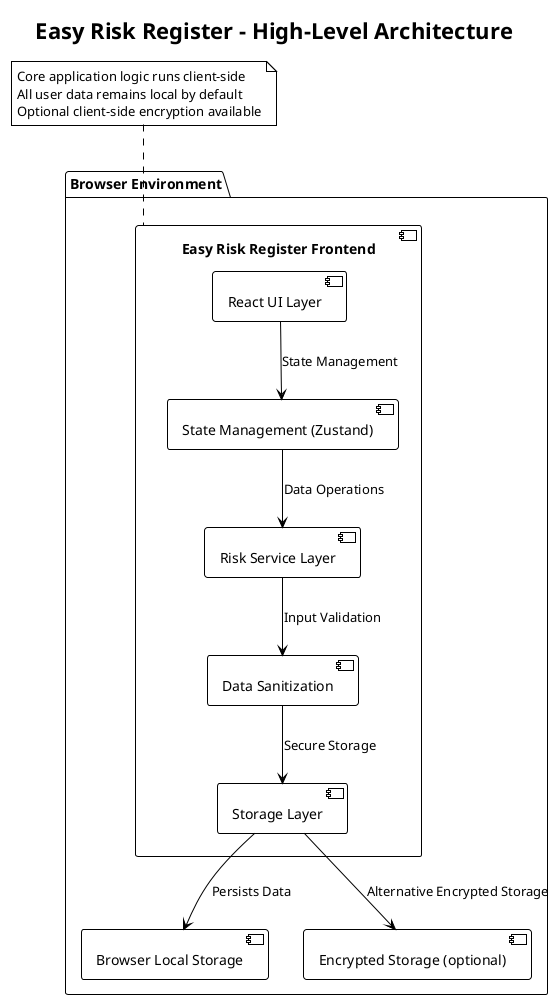

### Technology Stack Summary

**Frontend:**
- Core: React (via Vite) + TypeScript
- State Management: Zustand with persistence
- Forms: React Hook Form (built-in)
- Styling: Tailwind CSS
- UI Components: Custom Design System
- CSV Parsing: PapaParse
- Unique IDs: nanoid
- Build Tool: Vite
- Type Safety: TypeScript

**Data Management:**
- Primary Storage: Browser LocalStorage
- Optional Encrypted Storage: Client-side encryption
- Data Persistence: Zustand with middleware
- Input Sanitization: Custom validation functions

## For Frontend Engineers

### Component Architecture

#### Component Hierarchy Diagram

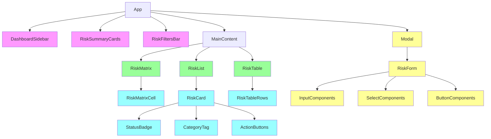

#### Core Component Structure
```
src/
├── App.tsx                   # Main application component
├── components/               # UI components by feature
│   ├── layout/
│   │   └── DashboardSidebar.tsx
│   ├── risk/
│   │   ├── RiskCard.tsx
│   │   ├── RiskFilters.tsx
│   │   ├── RiskForm.tsx
│   │   ├── RiskList.tsx
│   │   ├── RiskMatrix.tsx
│   │   ├── RiskSummaryCards.tsx
│   │   └── RiskTable.tsx
│   └── AccessibilityTester.tsx
├── constants/                # Application constants
│   └── risk.ts
├── design-system/            # Reusable UI components
│   ├── components/
│   │   ├── Badge.tsx
│   │   ├── Button.tsx
│   │   ├── Card.tsx
│   │   ├── Input.tsx
│   │   ├── Modal.tsx
│   │   ├── SectionHeader.tsx
│   │   ├── Select.tsx
│   │   ├── StatCard.tsx
│   │   ├── Table.tsx
│   │   └── Textarea.tsx
│   ├── index.ts
│   └── tokens.ts
├── hooks/                    # React hooks (currently empty)
├── services/                 # Business logic layer
│   └── riskService.ts
├── stores/                   # State management
│   └── riskStore.ts
├── types/                    # TypeScript type definitions
│   └── risk.ts
└── utils/                    # Utility functions
    ├── cn.ts                 # Tailwind class merging
    ├── encryption.ts         # Client-side encryption
    ├── encryption.test.ts
    ├── focusTrap.ts          # Accessibility utility
    ├── riskCalculations.ts
    ├── sanitization.ts       # Input sanitization
    ├── sanitization.test.ts
    ├── SecureStorage.ts
    └── ZustandEncryptedStorage.ts
```

#### State Management Architecture

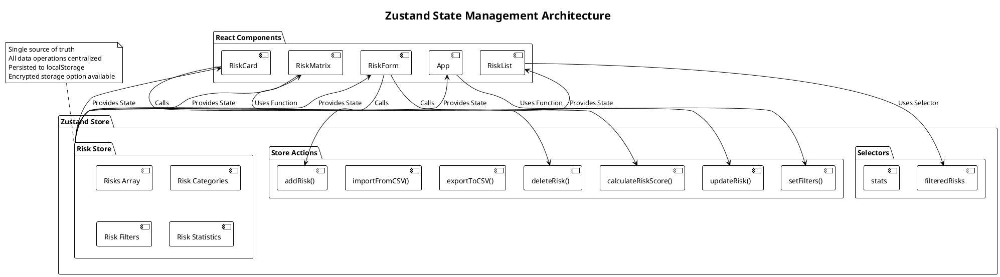

#### State Management (Zustand Store)

The application uses a single Zustand store with persistence and encryption capabilities:

```typescript
// src/stores/riskStore.ts
interface Risk {
  id: string
  title: string
  description: string
  probability: number // 1-5 scale
  impact: number      // 1-5 scale
  riskScore: number   // probability * impact
  category: string
  status: 'open' | 'mitigated' | 'closed'
  mitigationPlan: string
  creationDate: string // ISO format
  lastModified: string // ISO format
}

interface RiskInput {
  title: string
  description: string
  probability: number
  impact: number
  category: string
  status?: RiskStatus
  mitigationPlan?: string
}

interface RiskStoreState {
  initialized: boolean
  risks: Risk[]
  filteredRisks: Risk[]
  categories: string[]
  filters: RiskFilters
  stats: RiskStats
  addRisk: (input: RiskInput) => Risk
  updateRisk: (
    id: string,
    updates: Partial<RiskInput> & { status?: Risk['status'] },
  ) => Risk | null
  deleteRisk: (id: string) => void
  addCategory: (category: string) => void
  setFilters: (updates: Partial<RiskFilters>) => void
  bulkImport: (risks: Risk[]) => void
  exportToCSV: () => string
  importFromCSV: (csv: string) => number
  seedDemoData: () => number
}
```

### Data Flow Architecture

#### Risk Creation Flow

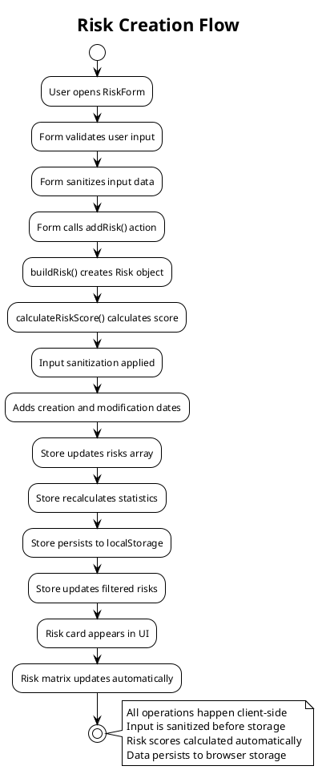

#### Risk Update Flow

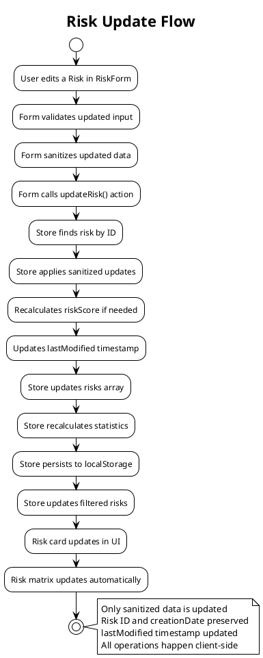

### Service Layer Architecture

The application uses a service layer pattern to separate business logic from UI components:

```typescript
// src/services/riskService.ts
export const riskService = {
  list: (): Risk[] => useRiskStore.getState().filteredRisks,
  listAll: (): Risk[] => useRiskStore.getState().risks,
  getById: (id: string): Risk | undefined =>
    useRiskStore.getState().risks.find((risk) => risk.id === id),
  create: (input: RiskInput) => useRiskStore.getState().addRisk(input),
  update: (
    id: string,
    updates: Partial<RiskInput> & { status?: Risk['status'] },
  ) => useRiskStore.getState().updateRisk(id, updates),
  remove: (id: string) => useRiskStore.getState().deleteRisk(id),
  setFilters: (updates: Partial<RiskFilters>) =>
    useRiskStore.getState().setFilters(updates),
  exportCSV: () => useRiskStore.getState().exportToCSV(),
  importCSV: (csv: string) => useRiskStore.getState().importFromCSV(csv),
  seedDemoData: () => useRiskStore.getState().seedDemoData(),
}

export const useRiskManagement = () => {
  // Custom hook that provides all necessary data and actions
  return { risks, stats, filters, categories, actions }
}
```

### Input Sanitization Architecture

The application implements comprehensive input sanitization to prevent XSS and other security vulnerabilities:

```typescript
// src/utils/sanitization.ts
export const sanitizeTextInput = (input: string): string => {
  if (typeof input !== 'string') return ''

  // Remove potentially dangerous characters
  return input
    .replace(/</g, '&lt;')
    .replace(/>/g, '&gt;')
    .replace(/"/g, '&quot;')
    .replace(/'/g, '&#x27;')
    .trim()
}

export const sanitizeRiskInput = (input: unknown): Partial<RiskInput> => {
  if (typeof input !== 'object' || input === null) return {}

  const result: Partial<RiskInput> = {}

  if (typeof (input as any).title === 'string') {
    result.title = sanitizeTextInput((input as any).title)
  }

  if (typeof (input as any).description === 'string') {
    result.description = sanitizeTextInput((input as any).description)
  }

  // Similar sanitization for other fields...

  return result
}
```

### Responsive Design Strategy

#### Responsive Layout Architecture

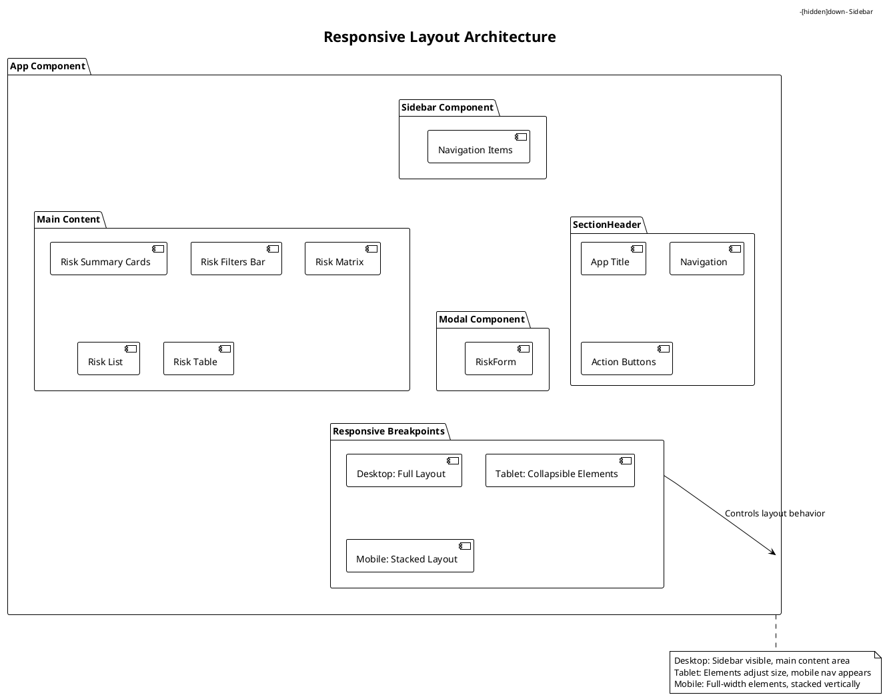

The application uses Tailwind CSS for responsive design with mobile-first approach:

```typescript
// Responsive classes used throughout
<div className="mx-auto w-full max-w-[1400px] gap-8 px-4 py-8 sm:px-6 lg:px-10">
  {/* Main container with responsive max-width and padding */}
</div>

<div className="flex flex-col gap-8 lg:hidden">
  {/* Mobile navigation visible only on small screens */}
</div>

<button className={cn(
  'flex-1 min-w-[160px] rounded-2xl border px-4 py-3 text-left text-sm transition',
  isActive
    ? 'border-brand-primary bg-brand-primary-light/60 text-brand-primary'
    : 'border-border-subtle bg-surface-secondary text-text-high',
)}>
  {/* Responsive button with conditional styling */}
</button>
```

### Performance Optimization Strategies

- Memoization for expensive calculations using useMemo and useCallback
- Efficient state updates to prevent unnecessary re-renders
- Virtualized components for large lists (planned future feature)
- Lazy loading for non-critical components
- Client-side data filtering for responsive UI

#### Performance Architecture

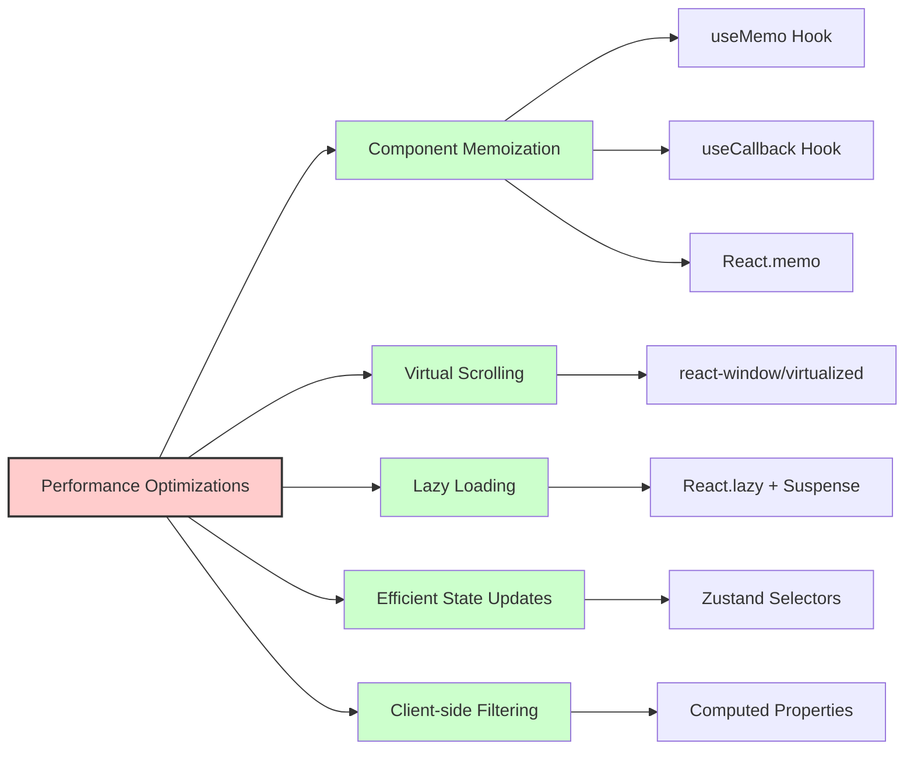

## For QA Engineers

### Testable Component Boundaries

#### Unit Testing Strategy
- Risk calculation functions: `calculateRiskScore(probability, impact)` - calculates probability × impact (5x5 matrix, scores 1-25)
- Risk severity functions: `getRiskSeverity(score)` - determines Low (≤3), Medium (≤6), High (>6)
- Form validation logic: Input sanitization and validation
- Export functionality: CSV generation and data integrity
- State management: Store updates and persistence
- Sanitization utilities: XSS prevention and input cleaning

#### Integration Testing Points
- Risk form submission and data persistence flow
- Risk matrix visualization updates with data changes
- CSV import/export roundtrip validation
- Filter functionality with data updates
- Modal open/close interactions
- LocalStorage data consistency

### Data Validation Requirements

#### Input Validation
- Risk title: Required, max 200 characters, sanitized
- Risk description: Optional, max 1000 characters, sanitized
- Probability: Required, numeric 1-5, clamped to range
- Impact: Required, numeric 1-5, clamped to range
- Category: Required from predefined list or custom, sanitized
- Mitigation plan: Optional, max 2000 characters, sanitized
- Status: 'open', 'mitigated', or 'closed' (defaults to 'open')

#### Data Integrity Checks
- Risk scores correctly calculated as probability × impact (range 1-25 for 5x5 matrix)
- Risk severity correctly determined: Low (≤3), Medium (≤6), High (>6)
- Risk IDs are unique and properly formatted (nanoid)
- Dates are properly formatted as ISO strings
- Data persists across browser sessions
- CSV imports validate for injection attempts

### Performance Quality Metrics

- Page load time: <3 seconds on standard broadband
- Form submission response: <1 second
- Matrix visualization update: <500ms for data changes
- Filter application: <300ms for data updates
- Application handles up to 1000 risk entries with acceptable performance

### Security Testing Considerations

- XSS prevention: Input sanitization for all user-entered text
- Data isolation: Verify no data leakage between sessions
- LocalStorage security: Validate data sanitization before storage
- CSV import security: Check for formula injection prevention
- Form injection: Test for malicious script injection attempts
- Encrypted storage: Verify encryption/decryption functionality

## For Security Analysts

### Data Security Architecture

#### Client-Side Security
- Input sanitization for all user-entered data using dedicated sanitization utilities
- XSS prevention through output encoding and input sanitization
- No external API calls by default (privacy-first)
- Client-side encryption option for sensitive data storage
- CSV import validation to prevent formula injection

#### Storage Security
- Default: Browser LocalStorage with JSON serialization
- Optional: Client-side encrypted storage using AES-GCM encryption
- Data sanitization before serialization
- Memory-safe storage implementations for server environments

### Vulnerability Prevention

#### XSS Prevention
- Sanitize all user inputs before rendering using `sanitizeTextInput()` utility
- Use React's built-in XSS protection for dynamic content
- Validate and sanitize all data before storage
- HTML character encoding for dangerous characters

#### Data Privacy
- Clear data isolation between user sessions
- Client-side only processing of risk data
- Export data is sanitized before CSV generation
- No external data transmission by default

#### Security Architecture Diagram

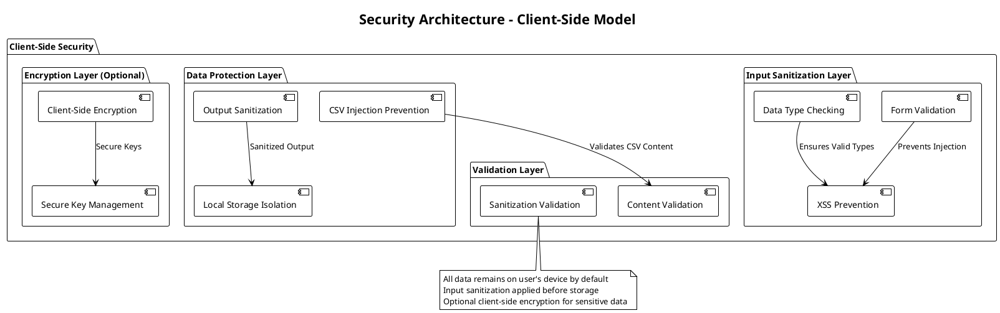

### Security Implementation Details

#### Input Sanitization Process
```typescript
// src/utils/sanitization.ts
export const sanitizeTextInput = (input: string): string => {
  if (typeof input !== 'string') return ''

  return input
    .replace(/</g, '&lt;')      // Prevent HTML injection
    .replace(/>/g, '&gt;')      // Prevent HTML injection
    .replace(/"/g, '&quot;')    // Prevent attribute injection
    .replace(/'/g, '&#x27;')    // Prevent attribute injection
    .replace(/javascript:/gi, '') // Prevent JS injection
    .replace(/vbscript:/gi, '')  // Prevent VBScript injection
    .trim()
}

export const validateCSVContent = (csv: string): boolean => {
  // Check for potential formula injection patterns
  const dangerousPatterns = [
    /=/,
    /-/,
    /\+/,
    /@/,
    /\\t/,
    /\\r/,
    /\\n/
  ];

  // Only allow safe CSV content
  return !dangerousPatterns.some(pattern => pattern.test(csv));
}
```

## For DevOps Engineers

### Build and Deployment

#### Vite Configuration
```typescript
// vite.config.ts
export default defineConfig({
  plugins: [react()],
  build: {
    rollupOptions: {
      output: {
        manualChunks: {
          'vendor-react': ['react', 'react-dom'],
          'vendor-zustand': ['zustand'],
        }
      }
    }
  },
  define: {
    global: 'globalThis',
  },
});
```

### Client-Side Storage Implementation

#### Persistent Storage Strategy

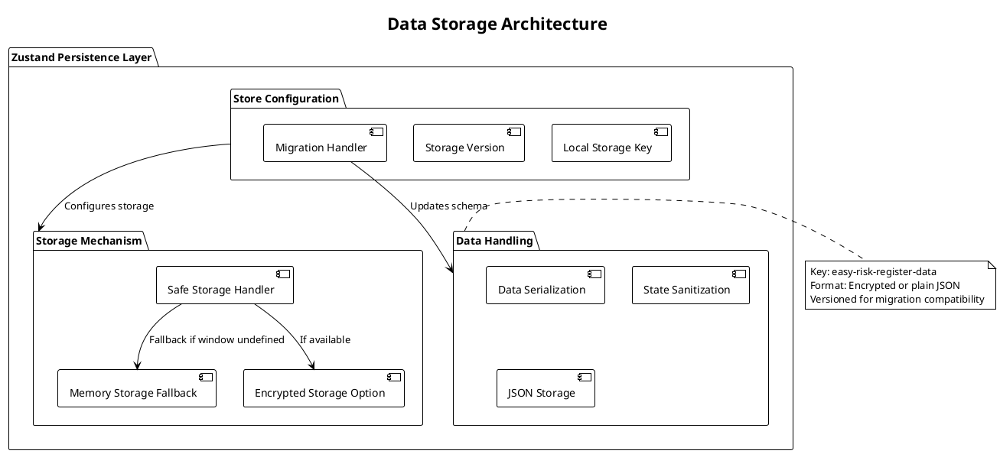

#### Storage Implementation
```typescript
// src/stores/riskStore.ts
const safeStorage = () => {
  if (typeof window === 'undefined') {
    return memoryStorage() // Server-side fallback
  }

  // Check if secure storage is available, otherwise default to localStorage
  if (ZustandEncryptedStorage.isAvailable()) {
    return new ZustandEncryptedStorage()
  }

  return window.localStorage
}

// Memory storage implementation for SSR
const memoryStorage = (): Storage => {
  const store = new Map<string, string>()
  return {
    get length() {
      return store.size
    },
    clear: () => store.clear(),
    getItem: (key: string) => store.get(key) ?? null,
    key: (index: number) => Array.from(store.keys())[index] ?? null,
    removeItem: (key: string) => {
      store.delete(key)
    },
    setItem: (key: string, value: string) => {
      store.set(key, value)
    },
  } as Storage
}
```

## Data Architecture Specifications

### Entity Design

#### Risk Entity
- **Entity Name**: Risk
- **Purpose**: Represents a single risk item with all necessary attributes for risk management
- **Attributes**:
  - `id` (string, nanoid, required, primary key)
  - `title` (string, sanitized, max 200 chars, required)
  - `description` (string, sanitized, max 1000 chars, optional)
  - `probability` (number, 1-5 scale, clamped, required)
  - `impact` (number, 1-5 scale, clamped, required)
  - `riskScore` (number, calculated as probability × impact, required)
  - `category` (string, sanitized, required)
  - `status` (string, 'open'|'mitigated'|'closed', default: 'open')
  - `mitigationPlan` (string, sanitized, max 2000 chars, optional)
  - `creationDate` (ISOString, required)
  - `lastModified` (ISOString, required)

#### RiskInput Entity
- **Entity Name**: RiskInput
- **Purpose**: Input model for creating/updating risks
- **Attributes**:
  - `title` (string, sanitized, required)
  - `description` (string, sanitized, required)
  - `probability` (number, 1-5 scale, required)
  - `impact` (number, 1-5 scale, required)
  - `category` (string, sanitized, required)
  - `status` (RiskStatus, optional)
  - `mitigationPlan` (string, sanitized, optional)

### Data Storage Strategy

#### Storage Architecture Diagram

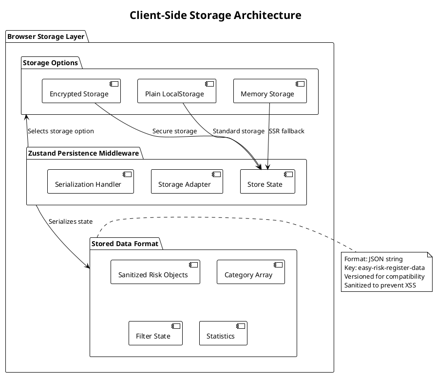

#### Client-Side Storage Schema
```typescript
interface StoredRiskData {
  state: {
    risks: Risk[];
    categories: string[];
    filters: RiskFilters;
    stats: RiskStats;
    initialized: boolean;
  };
  version: number; // For migration purposes
  timestamp: number; // For cache invalidation
}
```

#### Storage Implementation Details
- Key: `easy-risk-register-data`
- Format: JSON string (encrypted option available)
- Size: Optimized to stay within browser limits (typically 5-10MB)
- Backup: Export functionality to prevent data loss
- Security: Input sanitization applied before storage
- Versioning: For migration compatibility

## API Contract Specifications

### Client-Side Service Layer (Internal)

The application uses a service layer pattern instead of direct store access to provide a clean API:

#### Risk Management Service

**Create Risk**
- Method: `riskService.create(input)`
- Parameters: `RiskInput` object
- Returns: `Risk` object (with generated ID and calculated values)
- Side effect: Updates store state, recalculates stats, persists to storage

**Get All Risks**
- Method: `riskService.list()`
- Parameters: None
- Returns: `Risk[]` (filtered risks based on current filters)

**Get All Risks (Unfiltered)**
- Method: `riskService.listAll()`
- Parameters: None
- Returns: `Risk[]` (all risks, no filtering applied)

**Get Risk by ID**
- Method: `riskService.getById(id)`
- Parameters: `id` (string)
- Returns: `Risk | undefined`

**Update Risk**
- Method: `riskService.update(id, updates)`
- Parameters: `id` (string), `updates` (Partial<RiskInput>)
- Returns: Updated `Risk` object or `null` if not found

**Delete Risk**
- Method: `riskService.remove(id)`
- Parameters: `id` (string)
- Returns: `void`
- Side effect: Removes risk from store, recalculates stats

**Filter Risks**
- Method: `riskService.setFilters(updates)`
- Parameters: `updates` (Partial<RiskFilters>)
- Returns: `void`
- Side effect: Updates filter state and triggers recalculation

**Export to CSV**
- Method: `riskService.exportCSV()`
- Parameters: None
- Returns: `string` (CSV formatted data)
- Includes sanitization to prevent formula injection

**Import from CSV**
- Method: `riskService.importCSV(csv)`
- Parameters: `csv` (string)
- Returns: `number` (count of imported risks)
- Includes validation and sanitization

**Seed Demo Data**
- Method: `riskService.seedDemoData()`
- Parameters: None
- Returns: `number` (count of seeded risks)
- Only runs if no risks exist

### Custom Hook API

#### useRiskManagement Hook

The application provides a comprehensive custom hook that exposes all necessary functionality:

```typescript
const { risks, stats, filters, categories, actions } = useRiskManagement()

// Actions exposed:
actions.addRisk(riskInput)
actions.updateRisk(id, updates)
actions.deleteRisk(id)
actions.setFilters(filterUpdates)
actions.exportToCSV()
actions.importFromCSV(csv)
actions.seedDemoData()
```

### Data Flow Architecture

#### Risk Creation Data Flow

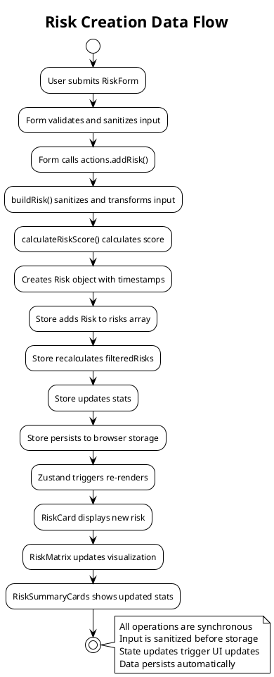

#### CSV Import Data Flow

```plantuml
!theme plain
title CSV Import Data Flow

start
:User selects CSV file;
:FileReader reads file content;
:actions.importFromCSV() called;

:validateCSVContent() checks for injection;
:PapaParse parses CSV securely;
:Sanitizes each imported risk;

:Filters out invalid risks;
:buildRisk() for each valid risk;
:Adds risks to store;

:Store recalculates all data;
:Store persists to browser storage;
:UI updates with new risks;
stop

note right
  CSV validation prevents injection
  Each risk is individually sanitized
  Only valid risks are imported
  All operations client-side
end note

@enduml
```

## Security and Performance Foundation

### Security Architecture

#### Input Sanitization Pipeline
- All user inputs are sanitized before processing
- HTML character encoding prevents XSS
- CSV content validation prevents formula injection
- Data is sanitized both on input and output
- Client-side encryption option for sensitive storage

#### Client-Side Security Measures
- Input sanitization at the point of entry
- Secure CSV parsing with validation
- Client-side encryption available for storage
- Output sanitization for display
- Content security policy recommendations

### Performance Architecture

#### Caching Strategy
- In-memory caching through Zustand store
- Computed properties for filtered risks and stats
- Efficient selector functions to minimize re-renders
- CSV export cached to prevent recalculation

#### Optimization Approaches
- Memoization for expensive calculations with useMemo/useCallback
- Efficient state updates that only update changed data
- Client-side filtering for responsive UI
- Lazy initialization of store with seed data
- Optimized rendering with proper React patterns

This architecture provides a solid foundation for implementing the Easy Risk Register application while maintaining the privacy-first, client-side approach as specified in the product requirements. The layered architecture separates concerns effectively, with clear boundaries between UI, business logic, and data persistence layers.