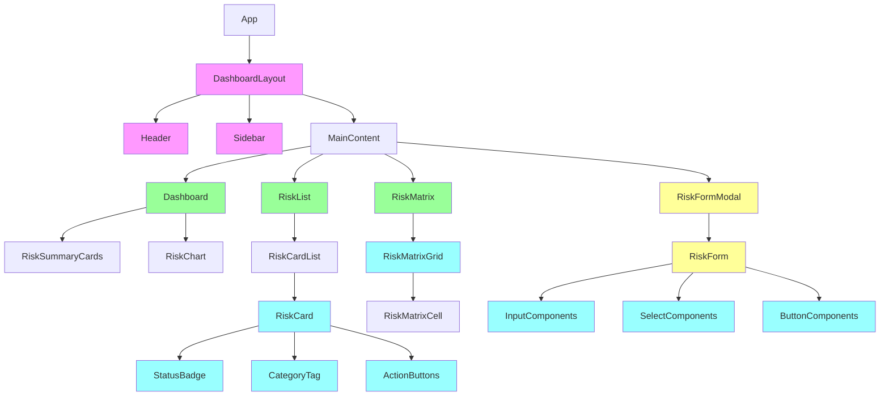
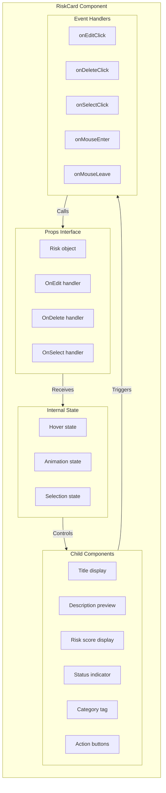
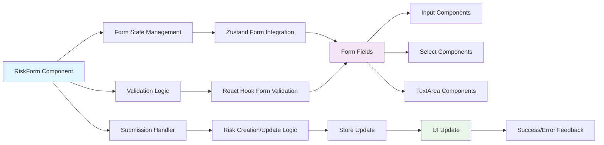
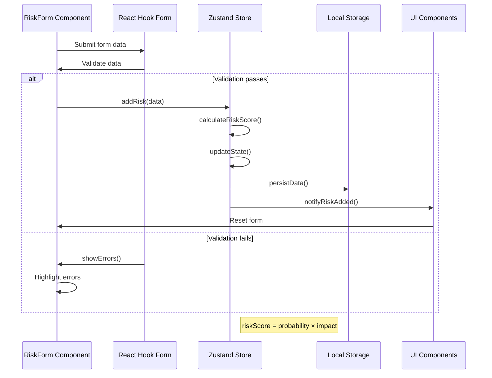
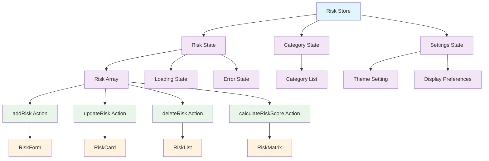
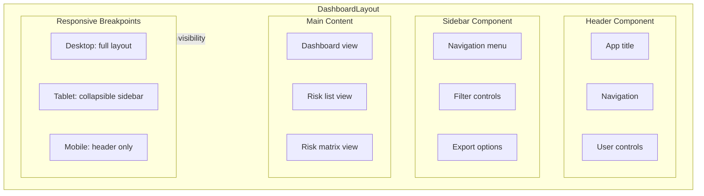
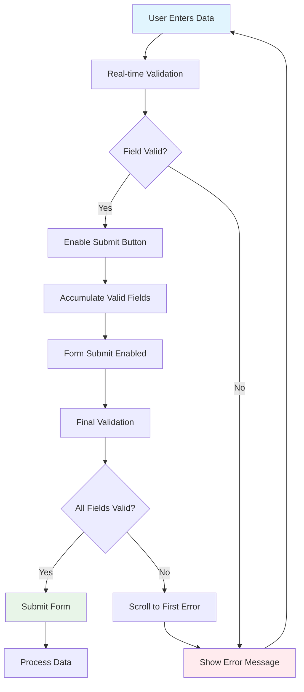
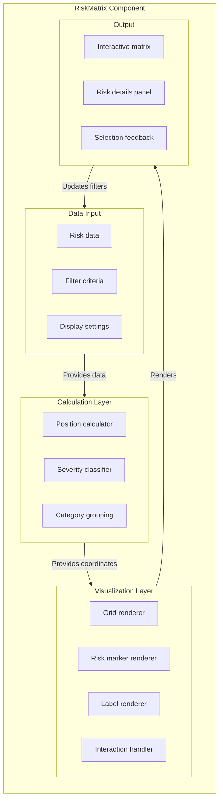
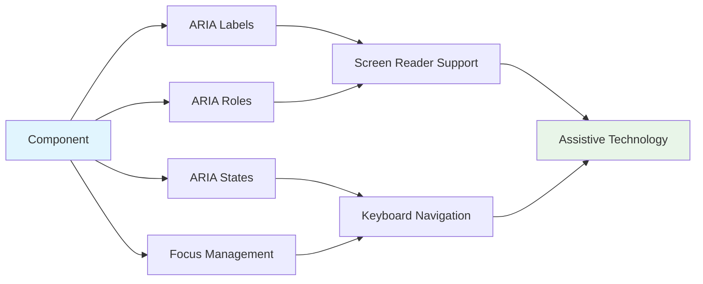
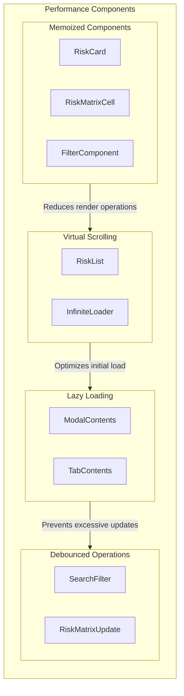

# Component Architecture - Risk Management Features

## Overview

This document details the component architecture for the risk management features in Easy Risk Register, showing how components interact and the data flow between them.

## Component Hierarchy

## Risk Card Component Architecture

## Risk Form Architecture

## Data Flow Architecture

### Risk Creation Flow

## Component State Management

### Zustand Store Pattern

## Responsive Component Architecture

### Layout Components Structure

## Form Validation Architecture

### Input Validation Flow

## Risk Matrix Visualization Architecture

## Accessibility Architecture

### ARIA Implementation

## Performance Optimization Architecture

### Optimized Component Rendering

This component architecture documentation provides a detailed view of how the risk management features are structured, showing the relationships between components and the flow of data through the application.
