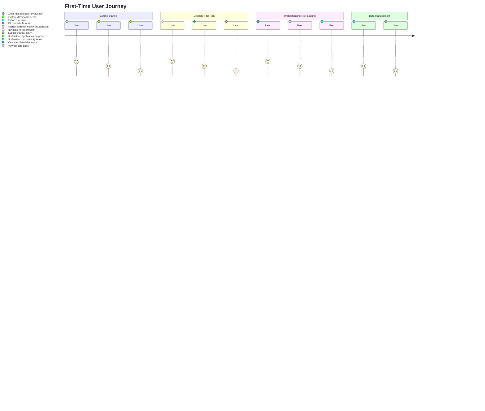
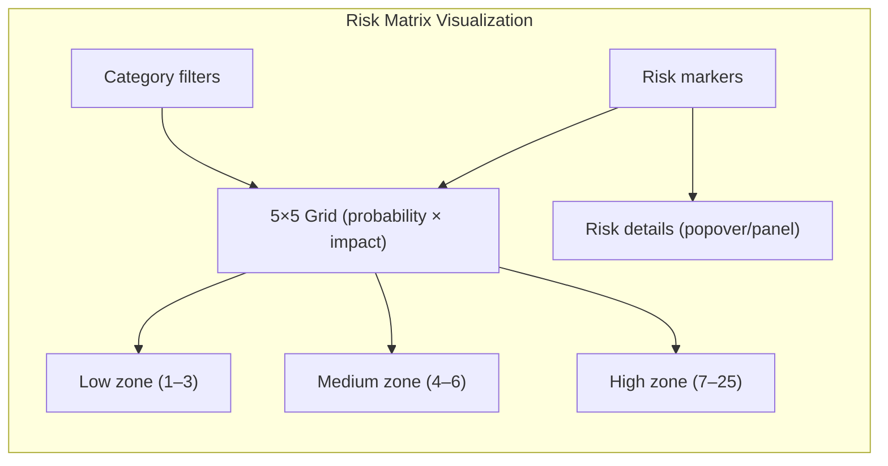
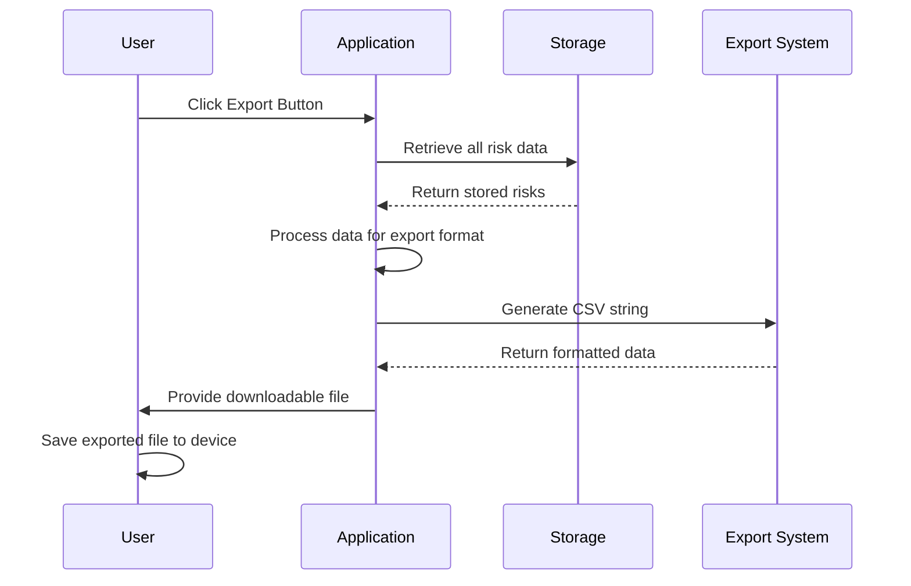
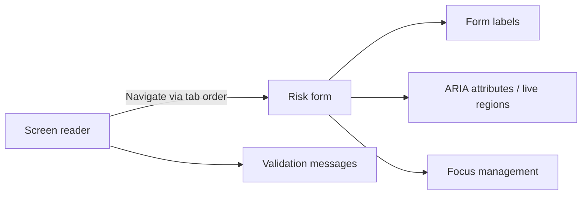
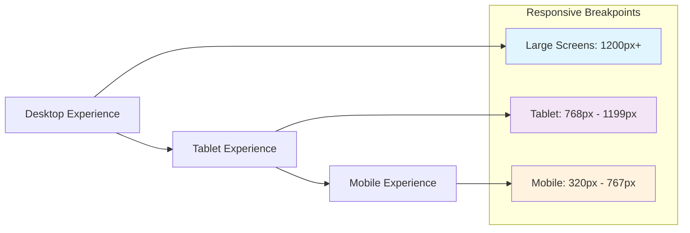
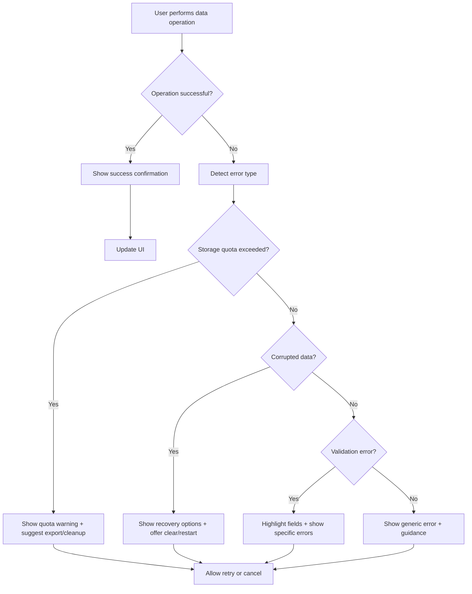
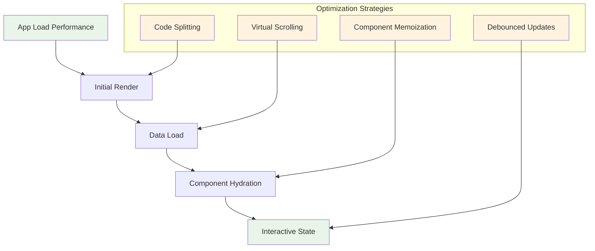
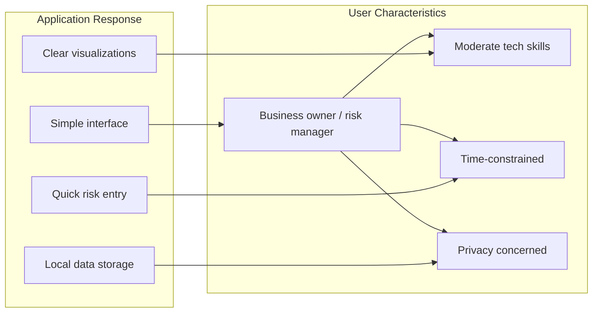

# User Journey Documentation - Easy Risk Register

## Overview

This document outlines the primary user journeys and experiences for the Easy Risk Register application, including visual flow diagrams to illustrate the user interaction patterns.

## Primary User Journeys

### 1. First-Time User Journey



### 2. Regular Risk Management Journey

```mermaid
flowchart TD
  A[User accesses application] --> B{Has existing risks?}
  B -->|Yes| C[Load risks from storage]
  B -->|No| D[Show empty state guidance]
  C --> E[Display dashboard]
  D --> E

  E --> F{Select action}
  F -->|Add risk| G[Open risk creation form]
  F -->|View risks| H[Show list + matrix + summary]
  F -->|Filter/sort| I[Apply filters and update views]

  G --> J[Validate input]
  J --> K{Valid?}
  K -->|No| L[Show validation errors]
  L --> G
  K -->|Yes| M[Calculate risk score (probability × impact)]
  M --> N[Save risk to storage]
  N --> O[Show success + update dashboard]

  H --> P{Interact with existing risk}
  I --> P
  O --> P

  P -->|Edit| Q[Open edit form, save updates]
  P -->|Delete| R[Confirm, delete, update views]
```

## Detailed Feature Workflows

### Risk Creation Workflow

```mermaid
flowchart TD
    A[User clicks "Add New Risk"] --> B[Open Risk Creation Modal]
    B --> C[Display empty risk form]
    C --> D[User inputs risk details]
    D --> E[Real-time validation]
    E --> F{Form valid?}
    F -->|No| G[Show validation errors]
    G --> D
    F -->|Yes| H[Calculate risk score]
    H --> I[Save risk to store]
    I --> J[Update UI with new risk]
    J --> K[Close modal and show success message]
    K --> L[Risk appears in list and matrix]

    style A fill:#e1f5fe
    style L fill:#e8f5e8
    style F fill:#fff3e0
```

## Risk Matrix Visualization Journey



### Data Export Journey



## Accessibility Journey

### Screen Reader Experience



## Responsive Design Journey

### Multi-Device Experience



## Error Handling Journey

### Handling Data Issues



## Performance Journey

### Optimized User Experience



## User Personas Journey

### Target User Experience



This documentation provides a comprehensive view of user interactions with the Easy Risk Register application, showing how the application responds to different user needs and scenarios while maintaining the simplicity and privacy-focused approach of the product.
